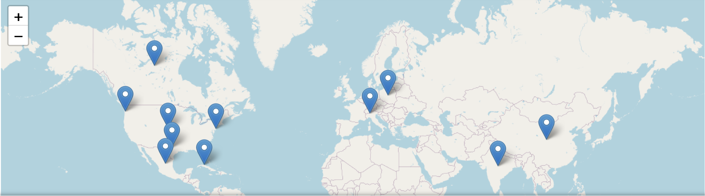

# Digital Mapping for Humanists: A Geoparsing Workshop
[](https://mybinder.org/v2/gh/askonivala/geodemo/HEAD?urlpath=%2Fdoc%2Ftree%2Fgeoparsing_demo.ipynb)
[](https://colab.research.google.com/github/askonivala/geodemo/blob/main/geoparsing_demo.ipynb)

Asko Nivala

University of Turku

## The aim of the workshop
This hands-on workshop introduces the basic principles of geoparsing – the process of identifying and interpreting place references in textual sources. Through practical exercises and group discussion, participants will learn how spatial information embedded in historical and literary texts can be extracted, visualised and analysed to support new kinds of research questions. No prior programming skills are required. By the end of the session, participants will have experimented with accessible tools to explore how texts can be transformed into maps, and how spatial approaches can enrich cultural and historical analysis.

## About this notebook
The workshop is based on this Jupyter Notebook. A Jupyter Notebook is a digital notebook that combines code, text and data in a single, interactive document. It allows researchers to write explanations, run small pieces of code (such as for analysing texts), and immediately see the results -- all in the same place. For humanists, it offers a gentle entry into digital research: you can explore language, visualise historical data or map places mentioned in texts, even with minimal programming experience.

This notebook will walk you through the geoparsing process and show some examples of Python code. Unfortunately, there is no ready-made software for geoparsing with a graphical user interface. You can execute each Python code cell by pressing the play button. Above the cell is documentation explaining what the code actually does.

## Installing Google Colab dependencies
If you want to run this notebook on Google Colab, you need to install the required libraries. This step is not necessary in Binder and might result in error.


```python
!pip install -r https://raw.githubusercontent.com/askonivala/geodemo/main/requirements.txt
```

## Importing libraries and creating NLP objects
Then we need to import required Python libraries. A Python library is a collection of prewritten code that provides tools for specific tasks, such as analysing text or creating maps. To use a library in your code, you import it at the beginning of your notebook with a command like `import spacy` or `import folium`.


```python
import time
import spacy
from geopy.geocoders import Nominatim
import folium
```

Next, we will load the English language model into SpaCy. Please note that this model needs to be installed in console before the first run: `python -m spacy download en_core_web_sm`.

After that line, we will load Nominatim. This line creates a geolocator object using the Nominatim service, allowing you to search for place names, with "geo_tutorial" identifying your application.


```python
nlp = spacy.load("en_core_web_sm")
geolocator = Nominatim(user_agent="geo_tutorial")
```

## NER (named-entity recognition)
The following code cell defines the text for which we will perform geoparsing analysis. You can place the text in the variable `text`. Please note that quotation marks must be closed for the line to work. In addition, the analysed text cannot contain quotation marks unless they are escaped appropriately.


```python
text = """
And thus have these naked Nantucketers, these sea hermits, issuing from
their ant-hill in the sea, overrun and conquered the watery world like
so many Alexanders; parcelling out among them the Atlantic, Pacific,
and Indian oceans, as the three pirate powers did Poland. Let America
add Mexico to Texas, and pile Cuba upon Canada; let the English
overswarm all India, and hang out their blazing banner from the sun;
two thirds of this terraqueous globe are the Nantucketer’s. For the sea
is his; he owns it, as Emperors own empires; other seamen having but a
right of way through it. Merchant ships are but extension bridges;
armed ones but floating forts; even pirates and privateers, though
following the sea as highwaymen the road, they but plunder other ships,
other fragments of the land like themselves, without seeking to draw
their living from the bottomless deep itself. The Nantucketer, he alone
resides and riots on the sea; he alone, in Bible language, goes down to
it in ships; to and fro ploughing it as his own special plantation.
_There_ is his home; _there_ lies his business, which a Noah’s flood
would not interrupt, though it overwhelmed all the millions in China.
He lives on the sea, as prairie cocks in the prairie; he hides among
the waves, he climbs them as chamois hunters climb the Alps. For years
he knows not the land; so that when he comes to it at last, it smells
like another world, more strangely than the moon would to an Earthsman.
With the landless gull, that at sunset folds her wings and is rocked to
sleep between billows; so at nightfall, the Nantucketer, out of sight
of land, furls his sails, and lays him to his rest, while under his
very pillow rush herds of walruses and whales.
"""
```

These two lines use a language model to find place names in the text. First, the `nlp(text)` command tells the computer to analyse the text using natural language processing, in other words the English language model that we load on SpaCy. Then, the second line goes through the results and collects all the words or phrases that the model recognises as geographical places (like cities or countries). They are encoded with "GPE" (geopolitical entity) tag. Then we use Python's list comprehension to save them into a list called `places`.


```python
doc = nlp(text)
places = [ent.text for ent in doc.ents if ent.label_ in ("GPE", "LOC")]
```

We can also check what kind of results were saved at this stage, although this is not required for the execution of the programme. We can see that document might entail also other entities than places, which we have selected based on "GPE" tag.


```python
for entity in doc.ents:
    print(entity.text, entity.label_)
print(places)
```

    Nantucketers PERSON
    Alexanders ORG
    Atlantic LOC
    Pacific LOC
    Indian NORP
    three CARDINAL
    Poland GPE
    America GPE
    Mexico GPE
    Texas GPE
    Cuba GPE
    Canada GPE
    English LANGUAGE
    India GPE
    two thirds CARDINAL
    Nantucketer PERSON
    Bible WORK_OF_ART
    Noah ORG
    millions CARDINAL
    China GPE
    Alps LOC
    years DATE
    Earthsman ORG
    Nantucketer FAC
    ['Atlantic', 'Pacific', 'Poland', 'America', 'Mexico', 'Texas', 'Cuba', 'Canada', 'India', 'China', 'Alps']


## Geolocating
Now we can try to find the coordinates for the place names using Nominatim. This block of code tries to find real-world map coordinates for each place name. For every place in the list, it asks an online map service (called a geolocator) to look it up. If the service finds a match, the place’s name along with its latitude and longitude (its exact position on Earth) are saved into a new list called `coords`. Finally, we print the contents of the variable to illustrate the results.

This step uses an external server, so it may take a long time or end with an error. That is why this implementation uses cache: in other words, it remembers which places have already been looked up, so if the same name appears again (like “Paris” in two different texts), it will not make a new request for the map service. This makes the code faster and more efficient — especially when analysing many texts.


```python
coords = []
try:
    cache
except NameError:
    cache = {}
    
for place in places:
    if place in cache:
        location = cache[place]
    else:
        try:
            location = geolocator.geocode(place)
            time.sleep(1)  # wait 1 second before next request
        except Exception as e:
            print(f"Error geocoding {place}: {e}")
            location = None
        cache[place] = location

    if location:
        coords.append((place, location.latitude, location.longitude))

print(coords)
```

    [('Atlantic', 39.5143268, -74.6632883), ('Pacific', 46.5334929, -123.768029), ('Poland', 52.215933, 19.134422), ('America', 39.7837304, -100.445882), ('Mexico', 23.6585116, -102.0077097), ('Texas', 31.2638905, -98.5456116), ('Cuba', 23.0131338, -80.8328748), ('Canada', 61.0666922, -107.991707), ('India', 22.3511148, 78.6677428), ('China', 35.000074, 104.999927), ('Alps', 45.9083263, 9.1420628)]


## Mapping
This code creates an interactive map and adds a marker for each place with known coordinates. It starts by centering the map roughly over Central Europe. Obviously, if you are entering a text that is located to elsewhere, you need to modify these values or zoom out manually. Then it adds a marker at each latitude and longitude from the coords list. When you click on a marker, it shows the name of the place. The final line displays the map in the notebook.


```python
map_ = folium.Map(location=[0, 0], zoom_start=2)
for name, lat, lon in coords:
    folium.Marker(location=[lat, lon], popup=name).add_to(map_)
map_
```


